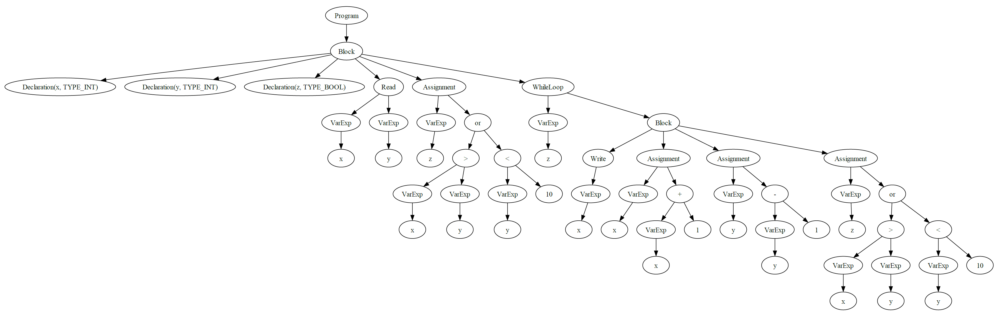

## 🙇 Authors
#### Thibault PERCHOC
#### Tanguy VIDAL

# Compilateur Iki
Ce projet est un mini compilateur pour le langage de programmation Iki, développé en Python. Le compilateur Iki comprend un lexer, un parser, un AST (Abstract Syntax Tree) et un visiteur. Il dispose de fonctionnalités graphiques supplémentaires. Le produit du compilateur est visible dans les fichiers produits et dans la console de débogage.

# Table des Matières

<!-- TOC start (generated with https://github.com/derlin/bitdowntoc) -->
  * [🙇 Authors](#-authors)
  * [Compilateur Iki](#compilateur-iki)
  * [Table des Matières](#table-des-matières)
  * [Langage Iki](#langage-iki)
    + [Syntaxe de Iki](#syntaxe-de-iki)
    + [Pourquoi ce langage ?](#pourquoi-ce-langage-)
    + [Exemple de programme écrit en Iki](#exemple-de-programme-écrit-en-iki)
  * [Base technique du projet](#base-technique-du-projet)
  * [Lexer](#lexer)
  * [Parser](#parser)
  * [AST (Abstract Syntax Tree)](#ast-abstract-syntax-tree)
  * [Visiteur](#visiteur)
    + [Checker](#checker)
    + [GraphPrinter](#graphprinter)
    + [PrettyPrinter](#prettyprinter)
  * [Comment utiliser ce compilateur](#comment-utiliser-ce-compilateur)
    + [Prérequis](#prérequis)
    + [Ce que vous retrouvez dans ce dépôt](#ce-que-vous-retrouvez-dans-ce-dépôt)
    + [Exécuter le code](#exécuter-le-code)
    + [Exécuter les tests unitaires](#exécuter-les-tests-unitaires)
  * [Comment contribuer à ce projet](#comment-contribuer-à-ce-projet)
  * [Contact](#contact)
<!-- TOC end -->

## Langage Iki
Iki est un petit langage de programmation qui a été développé pour illustrer les concepts de base de la compilation. Pour plus d'informations sur le langage Iki, consultez [ce lien](https://cs.lmu.edu/~ray/notes/iki/).

Le langage comprend des types de données tels que les entiers (`int`) et les booléens (`bool`), et prend en charge un ensemble d'opérations arithmétiques et booléennes. Iki offre également la possibilité d'écrire des boucles `while`.

Le langage est défini dans son ensemble sur cette page web: https://cs.lmu.edu/~ray/notes/iki/

### Syntaxe de Iki
Voici un aperçu de la syntaxe de Iki :

- Les déclarations de variables sont effectuées en utilisant le mot-clé `var`, suivi de l'identifiant de la variable et du type de la variable. Par exemple, `var x: int;`.
- Les affectations sont effectuées en utilisant l'opérateur `=`. Par exemple, `x = 5;`.
- Les opérations d'entrée et de sortie sont effectuées à l'aide des mots-clés `read` et `write` respectivement. Par exemple, `read x;` ou `write x;`.
- Les boucles sont définies en utilisant les mots-clés `while`, `loop` et `endw`. Par exemple, `while x > 0 loop x = x - 1; endw;`.

La syntaxe complète du langage, est décrite sur ce [site](https://cs.lmu.edu/~ray/notes/iki/) avec le langage Ohm

### Pourquoi ce langage ?

Le langage iki est un langage que nous ne connaissions pas et que nous n'avions jamais utilisé (il n'a d'ailleur nullement pour objectif d'être utilisé) c'était donc une bonne base pour reprendre tout le cours de compilation de 0. Reprendre de zero signifie ici comprendre la syntaxe du langage et son implémentation jusqu'à être capable de coder la chaine de compilation pour dire si oui ou non le code est conforme aux standards du langage.

Par ailleurs, c'est un langage très simplifié. Cela nous permet de nous concentrer sur la qualité du code. Il aurait été trop ambitieux de prendre un langage complet pour prétendre développer une chaine de compilation complète. Nous avons fait le choix d'un langage simple pour pouvoir couvrir tout le langage et proposer un projet qui reprennent, en les approfondissant, tous les concepts étudiés, sur un langage nouveau.

### Exemple de programme écrit en Iki
Voici un programme écrit en Iki :
```iki
var x: int;
var y: int;
var z: bool;

read x, y;
z = (x > y) or (y < 10);

while z loop
    write x;
    x = x + 1;
    y = y - 1;
    z = (x > y) or (y < 10);
endw;
```
## Base technique du projet
- Python, orienté object
- Utilisation d'expressions régulières (RegEx)
- Bibliothèque [Graphiz](https://graphviz.org/download/) (pour la génération d'AST sous forme graphique)

## Lexer
Le Lexer est une classe qui permet de convertir un texte, un code, en une liste de lexèmes (tokens) qui peuvent être utilisés par le parser. Pour cela, le lexer utilise une liste de regexes prédéfinies qui correspondent aux différents types de lexèmes que le langage Iki peut contenir (noms de variables, nombres, opérateurs, etc.).

La méthode "lex_file" prend en entrée le nom d'un fichier, l'ouvre et en lit son contenu. La méthode "lex" prend en entrée une liste de chaînes de caractères qui représentent le code source du programme. La méthode "match_line" est appelée pour chaque ligne de code source pour chercher tous les lexèmes correspondant aux regexes prédéfinies. La méthode "match_lexem" est appelée pour tester si une expression régulière correspond à un lexème particulier, et si c'est le cas, la méthode "append_lexem" est appelée pour ajouter le lexème à la liste des lexèmes trouvés.

En sortie du Lexer, nous obtenons une liste des lexems dans leur ordre d'apparition.

## Parser
Le Parser est une classe qui prend une liste de lexèmes en entrée et qui construit un arbre syntaxique abstrait à partir de ces lexèmes. L'arbre syntaxique est ensuite utilisé par la suite du compilateur pour générer du code exécutable.

Le Parser parcourt la liste des lexèmes en utilisant les méthodes "accept", "expect" et "show_next" pour extraire les lexèmes un par un et vérifier qu'ils correspondent à la grammaire du langage. La méthode "remove_comments" est appelée pour supprimer les commentaires de la liste des lexèmes.

Le Parser utilise une grammaire récursive pour construire l'arbre syntaxique, en appelant différentes méthodes pour chaque règle de la grammaire. Les méthodes de parsing sont organisées en couches, chaque couche correspondant à un niveau de priorité d'opérateur.

Les différentes méthodes sont responsables de la reconnaissance des différentes parties de la grammaire, telles que les déclarations de variables, les affectations, les opérations arithmétiques, les boucles while, les entrées/sorties, etc. À chaque étape, une instance de la classe correspondante de l'AST_iki est créée pour stocker la structure de l'arbre syntaxique.


## AST (Abstract Syntax Tree)
L'AST est utilisé par le visiteur pour effectuer diverses analyses et transformations sur le code source. L'AST est utilisé pour représenter la structure syntaxique du programme et est composé d'une hiérarchie de nœuds qui représentent les différentes parties du programme telles que les déclarations de variables, les expressions arithmétiques, les instructions conditionnelles, les boucles, etc. Chaque nœud dans l'AST a un type spécifique qui correspond à la structure syntaxique qu'il représente et contient des informations telles que les opérandes, les opérateurs et les valeurs associées à cette structure syntaxique.

Lorsque le programme est compilé, l'AST est parcouru par différentes passes de compilation qui effectuent des transformations sur le programme en utilisant les informations contenues dans l'AST. Ces transformations peuvent inclure des optimisations de code, la vérification de la cohérence du code ou la génération de code machine. Chaque étape peut être effectuée par un "visiteur" différent, thème de la prochine section.

## Visiteur
Nous utilisons le designe pattern Visitor (Patron de conception visiteur). Ce design pattern donnes les avantages suivants (extrait du cours):
- **Eviter de modifier la définition des classes** (qui peuvent être nombreuses)
- Découpler l'algorithme et la structure de données sur laquelle il opère
- Centraliser l'algorithme dans une seule classe

### Checker
Nous avons réalisé un visiteur nommé "Checker". 
Ce visiteur sert à valider la sémantique d'un programme en vérifiant que les règles sémantiques sont respectées. Plus précisément, il vérifie que les variables sont correctement déclarées, que les types des expressions sont compatibles, que les opérations sont valides, etc.

Chaque méthode du visiteur correspond à un type de nœud dans l'AST. La méthode est appelée sur le nœud correspondant et effectue des vérifications sémantiques spécifiques pour ce type de nœud. Par exemple, la méthode visit_Declaration vérifie que la variable déclarée n'existe pas déjà dans la table des symboles et l'ajoute à la table des symboles si elle n'existe pas. La méthode visit_Assignment vérifie que la variable à gauche de l'opérateur d'assignation a été déclarée auparavant. La méthode visit_BinaryOperator vérifie que les types des deux opérandes sont compatibles pour l'opérateur binaire correspondant.

Le visiteur utilise une table des symboles pour enregistrer les informations sur les variables déclarées, telles que leur nom et leur type. Les erreurs sont levées si une variable n'est pas déclarée ou si les types ne correspondent pas. Si aucune erreur n'est levée pendant la visite de l'AST, le programme est sémantiquement valide.

### GraphPrinter
GraphPrinter est utilisé pour afficher l'AST (arbre syntaxique abstrait) du langage Iki. La classe utilise la bibliothèque Graphviz pour générer un graphe représentant l'arbre. La méthode visit_* de la classe est appelée pour chaque type de nœud dans l'AST et crée un nœud correspondant dans le graphe avec les informations pertinentes (nom du nœud, opérateur, valeur, etc.). La méthode visit_* passe également l'identifiant du nœud parent pour créer une relation de lien entre le parent et le nœud courant dans le graphe. Le graphe généré permet de visualiser la structure de l'AST pour faciliter le débogage ou la compréhension du code source.
On aura ainsi ce résultat sur le code iki donné en exemple plus tôt:


### PrettyPrinter
PrettyPrinter permet d'afficher l'AST (arbre syntaxique abstrait) d'un programme en Iki en suivant une certaine convention de mise en forme. La classe visite chaque type de nœud dans l'AST et imprime le nom du nœud avec une indentation appropriée. Par exemple, les nœuds enfants sont indentés d'un niveau supplémentaire par rapport à leurs parents. Les nœuds de déclaration, d'assignation, de lecture et d'écriture affichent également des informations supplémentaires sur les variables et les types associés. L'affichage résultant est facile à lire et permet de visualiser la structure de l'AST de manière claire et concise.

## Comment utiliser ce compilateur
### Prérequis
Pour utiliser ce compilateur, assurez-vous d'avoir:
- Python installé sur votre machine. 
- Si vous souhaitez profiter des fonctionnalités graphiques de représentation dl'AST, vous devrez installer l'extension [Graphviz](https://graphviz.org/download/). Veillez à respecter la procédure d'installation (bibliothèque python et utilitaire de rendu qui permet la génération du graph).

### Ce que vous retrouvez dans ce dépôt

- Les classes qui instancient le Lexer, le Parser, tout l'AST, les visiteurs
- Des exemples de codes iki fonctionnels dans ressources/working_code_examples/
- Des exemples de codes iki ne respectant pas la grammaire, la syntaxe ou la sémantique, dans ressources/parser_error_examples
- Un code de test éxécutant les différentes étapes de compilation sur des exemples de code et vérifiant que le résultat est le bon : \_\_tests\_\_.py
- Un __main__.py permettant d'éxécuter toutes les étapes de compilations et tous les visiteurs sur un code iki choisit

### Exécuter le code

Pour exécuter le main:
```bash
# Se placer dans le dossier racine du projet
python3 .\__main__.py <chemin_vers_code_iki>
# Exemple :
python3 .\__main__.py .\ressources\working_code_examples\pgcd_euclide.iki
```


### Exécuter les tests unitaires
Pour lancer les tests unitaires:
```bash
python3 .\__tests__.py
```

Le résultat obtenu doit être de la forme :
```
Test passed: C:\Users\Tanguy\AppData\Local\Temp\tmpeml94ldl.iki
Expected: Code conforme, prêt à être compilé
Actual: Code conforme, prêt à être compilé
-------------------------
Test passed: C:\Users\Tanguy\AppData\Local\Temp\tmpbuhpuoie.iki
Expected: Variable 'x' already declared.
Actual: Variable 'x' already declared.
-------------------------
Test passed: C:\Users\Tanguy\AppData\Local\Temp\tmps97hb65k.iki
Expected: Type mismatch in assignment: variable 'x' expects type 'TYPE_INT', but found type 'TYPE_BOOL'.
Actual: Type mismatch in assignment: variable 'x' expects type 'TYPE_INT', but found type 'TYPE_BOOL'.

[...]
```

Tous les tests doivent être validés, c'est-à-dire avoir la mention "Test passed" et non "Test Failed"


## Comment contribuer à ce projet
Si vous souhaitez contribuer à ce projet, vous pouvez le forker et soumettre une pull request. Veuillez décrire clairement les modifications apportées et leur raison. Des tests unitaires pour vérifier la fonctionnalité de votre code seraient également appréciés.

## Contact
Si vous avez des questions ou des suggestions, n'hésitez pas à ouvrir un ticket. Nous apprécions vos commentaires pour améliorer ce projet.

